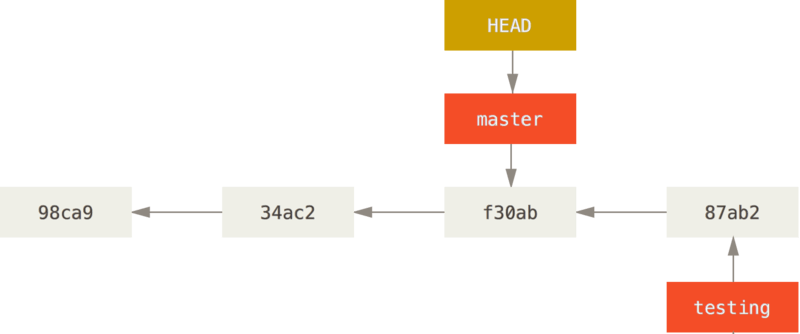

<h1>
    <span> Versionamento de Código com Git e GitHub</span>
</h1>

## Trabalhando com Branches criando, mesclando e tratando conflitos
### Criando um Novo Branch
Digamos que você crie um novo branch chamado: testing. Você faz isso com o comando `git branch`:
```
git branch testing
```
Isso cria um novo ponteiro para o mesmo commit em que você está atualmente. Agora são duas branches apontando para a mesma série de commits.


#### Como o Git sabe em qual branch você está atualmente? 
Ele mantém um ponteiro especial chamado `HEAD`. No Git, o `HEAD` é um ponteiro para o branch local em que você está. Neste caso, você ainda está em master. O comando `git branch` apenas criou um novo branch - ele não mudou para aquele branch.


#### Para criar uma branch e trocar automaticamente para esta branch nova, execute o comando `git checkout -b nome_da_nota_branch`
```
git checkout -b testing
```
Isso cria e move o HEAD para o branch` testing`.


### Alternando entre Branches
Para mudar para um branch existente, você executa o comando `git checkout`. Vamos mudar para o novo branch testing:
```
$ git checkout testing
```
Isso move o `HEAD` e o aponta para o branch `testing`.


Após mover o `HEAD` para o branch `testing` e vamos fazer um novo 
`commit`, observe que o branch `testing` avançou, mas seu branch` master` ainda aponta para o `commit` em que você estava quando executou `git checkout` para alternar entre os branches.


Agora vamos voltar para o branch master:
```
$ git checkout master
```
Esse comando fez duas coisas. Ele moveu o ponteiro `HEAD` de volta para apontar para o `branch master`, e reverteu os arquivos em seu diretório de trabalho de volta para o snapshots para o qual `master` aponta.



Agora dentro do `branch master` faça um novo `commit`. Observe que o histórico do seu projeto divergiu, ambas as mudanças são isoladas em branches separados: você pode alternar entre os branches e mesclá-los quando estiver pronto.


### Histórico de diferenças
Você também pode ver isso facilmente com o comando `git log`:
#### Git log do `branch main`
```
$ git log
commit 156750e72089517a9fe132325fa357c2a45071d9 (HEAD -> main)
Author: eldhersa <eldher.sa.2015@gmail.com>
Date:   Fri May 17 12:42:48 2024 -0300

    commit-04

commit c46d26e91d71d7dc71b21602c0a5ba5b0ee2b4ee
Author: eldhersa <eldher.sa.2015@gmail.com>
Date:   Fri May 17 12:38:35 2024 -0300

    commit-02

commit b08b51f37d74e4fdd8f223a35e6de58a710a4574
Author: eldhersa <eldher.sa.2015@gmail.com>
Date:   Fri May 17 12:38:04 2024 -0300

    commit-01
```
#### Git log do `branch testing`

```
$ git log
commit 9a78fd3a8c1e8e3fc7530019051c8a2c8fa83f94 (HEAD -> testing)
Author: eldhersa <eldher.sa.2015@gmail.com>
Date:   Fri May 17 12:40:46 2024 -0300

    commit-03

commit c46d26e91d71d7dc71b21602c0a5ba5b0ee2b4ee
Author: eldhersa <eldher.sa.2015@gmail.com>
Date:   Fri May 17 12:38:35 2024 -0300

    commit-02

commit b08b51f37d74e4fdd8f223a35e6de58a710a4574
Author: eldhersa <eldher.sa.2015@gmail.com>
Date:   Fri May 17 12:38:04 2024 -0300

    commit-01
```
#### Outra alternativa é `git log --oneline --decorate --graph --all`
```
$ git log --oneline --decorate --graph --all
* 156750e (HEAD -> main) commit-04
| * 9a78fd3 (testing) commit-03
|/
* c46d26e commit-02
* b08b51f commit-01
* f182f10 (origin/main) soft
* 90adb1f Alteração no readme
```

